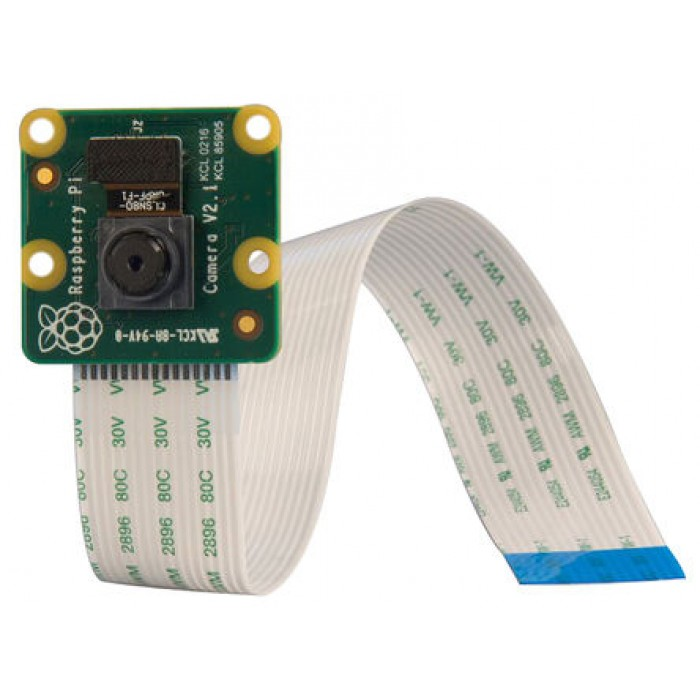
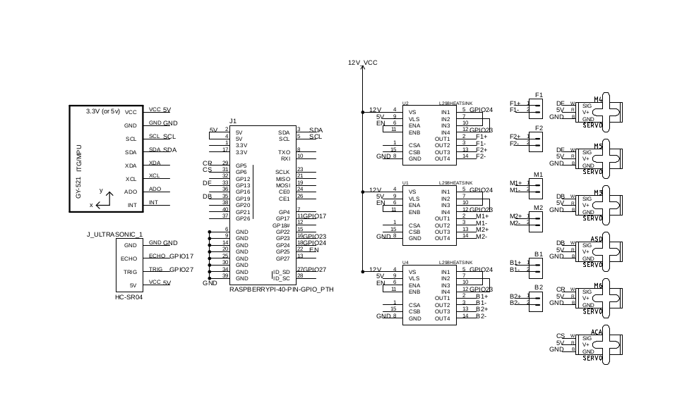

# DROOM 
#### A plant disease detecting bot

**Students:** 
              
              Hemant Garg @hemantgarg26
              
              Pranjal Shukla @shuklaps99
              
              Priyadarshan Roy @RoyPriyadarshan
              
              Rajan Gupta @rg-28 
              
              Shubhra Mittal @shubhramittal4
              
              Dinesh Kumar @dinesh4914
              
**Mentors:** 

             Dr. Garima Joshi
             
             Pranav Kumar @pranav083
             
**Code:**

## Objective 

- The primitive aim of the project is to detect and identify any sort of disease that originates in plants, without any kind of human interaction with the crops in the agricultural field. 
- Secondly, the data is to be sent to a local server for further processing by a software. 
- Thirdly, if there is any kind of discrepancy in the data, alert notification will be sent to the owner of the agricultural field.

## Introduction

### Problem Statement 
Now-a-days, due to the increased number of diseases in the agricultural fields across the crops, the production of the desired product is decreasing at a significant rate. This is to be tackled in a professional manner with correct use of efficient and economically stable technology. This can maneuver the agricultural production in a positive manner.

### Existing Technologies 

- There are few technologies which use visual inspection of plant germplasm and subsequent selection of healthy material. There are  technologies such as serodiagnostics, cytometry, real-time PCR. 
- The technology i.e. the bot that we will be using will not require any human interaction with the crops in the field.

## Project Overview 

### Block Diagram 

There are a few technologies which use Visual inspection of plant germplasm and subsequent selection of healthy materials. There are technologies such as sero-diagnostics, cytometry and real time PCR.

In our bot, image of the plant is captured through the camera which is controlled with the help of a gyroscope and servo motors. The gyroscope helps in stabilization of the camera and the servo motors provide the camera, a field of view through which the data is collected. The collected data is fed to the Raspberry Pi, which is our prime microcontroller used in this project. To the Raspberry Pi are connected a Magnetometer, GPS and Ultrasonic sensor. The magnetometer allows the bot to navigate through the field and the GPS gives the data of the current location in which the disease has been detected. The ultrasonic sensor plays a vital role of obstacle detection for the bot.

The bot primarily consists of 6 Motors in which four of them are the driving motors and two Servo Motors are attached for steering purposes. The Motors used in this project are simple Johnson Motors with 100 RPM, because this particular Motor provides an adequate speed for perfect detection of diseases in plant through the camera. Once the data is collected it is been uploaded to a server where the machine is trained to identify the disease and prescribe the accurate diagnosis to that particular disease. The machine is trained accordingly such that it also recommends the accurate brand for that particular disease and the nearest place where it is available.

## Detailed Description 

### Components 

#### Electronics  

|S. No.|Name|   Image   |Description|Quantity|
|:-----:|-----|-----|-----|:-----:|
|1|Raspberry pi|| The Raspberry Pi is a low cost, credit-card sized computer that plugs into a computer monitor or TV, and uses a standard keyboard and mouse. It is a capable little device that enables people of all ages to explore computing, and to learn how to program in languages like Scratch and Python. It’s capable of doing everything you’d expect a desktop computer to do, from browsing the internet and playing high-definition video, to making spreadsheets, word-processing, and playing games. |1| 
|2|nRF Transeiver|| nRF24L01 is a single chip radio transceiver for the world wide 2.4 - 2.5 GHz ISM band. The transceiver consists of a fully integrated frequency synthesizer, a power amplifier, a crystal oscillator, a demodulator, modulator and Enhanced ShockBurst protocol engine. Output power, frequency channels, and protocol setup are easily programmable through a SPI interface. Current consumption is very low, only 9.0mA at an output power of -6dBm and 12.3mA in RX mode. Built-in Power Down and Standby modes makes power saving easily realizable. |1|
|3|NEO-6M GPS|| The NEO-6M GPS module is a well-performing complete GPS receiver with a built-in 25 x 25 x 4mm ceramic antenna, which provides a strong satellite search capability. With the power and signal indicators, you can monitor the status of the module. |1|
|4|Gyroscope  GY-521|| The MPU6050 contains both a 3-Axis Gyroscope and a 3-Axis accelerometer allowing measurements of both independently, but all based around the same axes, thus eliminating the problems of cross-axis errors when using separate devices. |1| 
|5|Ultrasonic  HC-sr05|| The HC-SR04 ultrasonic sensor uses sonar to determine distance to an object like bats do. It offers excellent non-contact range detection with high accuracy and stable readings in an easy-to-use package. It comes complete with ultrasonic transmitter and receiver modules. |1|
|6|L298 Motor  Driver|| It is a high voltage, high current dual full-bridge driver designed to accept standard TTL logic levels and drive inductive loads such as relays, solenoids, DC and stepping motors. |3| 
|7|Servo Motor|| A servo motor is a rotary actuator or motor that allows for a precise control in terms of angular position, acceleration and velocity, capabilities that a regular motor does not have. It makes use of a regular motor and pairs it with a sensor for position feedback. The controller is the most sophisticated part of the servo motor, as it is specifically designed for the purpose. |6|
|8|Johnson  Motor  100 rpm|| The motor will run smoothly between the voltage range 6 to 18 V DC and give you 100 RPM at 12V supply. It provides the torque of 6.5 kg-cm at 100 RPM. These Grade A Quality Johnson DC Motors are well known for their reliability. |1|
|9|Picam|| The Pi camera module is a portable light weight camera that supports Raspberry Pi. It communicates with Pi using the MIPI camera serial interface protocol. It is normally used in image processing, machine learning or in surveillance projects. It is commonly used in surveillance drones since the payload of camera is very less. Apart from these modules Pi can also use normal USB webcams that are used along with computer. |1| 
|10|Micro-  controller  PIC18F452|     | 
|11|Joystick  Module|| A joystick is an input device consisting of a stick that pivots on a base and reports its angle or direction to the device it is controlling. |1|

#### Mechanical 

### Circuit Diagram 

### Timeline 
##### Week 1  
* Discussion of basic outline of project.
* Finalization of hardware and software to be used.
* Familiarization with Raspberry pi and python.  
##### Week 2  
* Collection of hardware, both for electronics and mechanical.
* Integration and interfacing of individual modules with Raspberry pi.
* Finalization of design using CAD Modelling.
* Prototype base of bot ready.  
##### Week 3  
* Communication with remote.
* Testing and debugging to confirm the following:
  * Sensor threshold values
  * Physical Stability 
  * Callibration 
* Documentation and Final report.  

### Progress Till now
##### Week 1  
  * Day 1: Discussion of basic outline of the project; selection of components, both hardware and software; preparation of timeline.  
  * Day 2: Familiarization with hardware.  
  * Day 3: Setting up of Raspberry pi.  
##### Week 2  
  * Day 1: Interfacing L298 motor driver and HC-sr05 Ultrasonic sensor.  
  * Day 2: Basic CAD Model prepared.  
  * Day 3: Interfacing of MPU6050 done.  
  * Day 4: CAD model fully prepared. 
##### Week 3  
  * Day 1: Preparation of circuit diagram.
  * Day 2: Code for Ultrasonic sensor and motor driver combined.
  * Day 3: Actual prototype partially prepared.
  * Day 4: Circuit diagram prepared. 
  

## Final Goals 

## Future Scope 

## References 

https://opensourcerover.jpl.nasa.gov/  
https://www.raspberrypi.org/  
https://help.github.com/en/articles/basic-writing-and-formatting-syntax  
